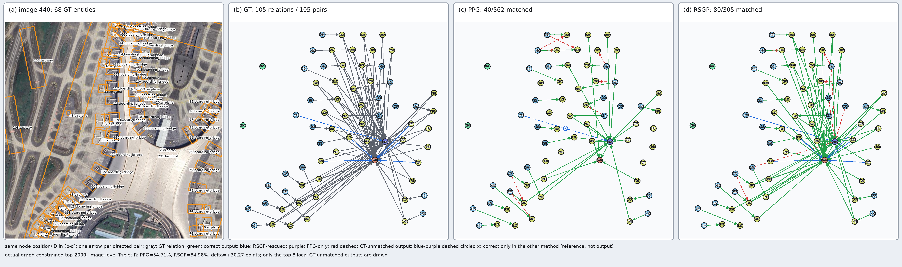
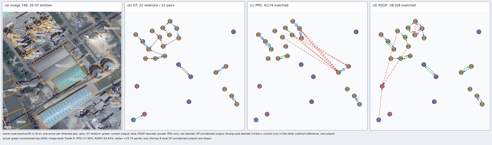
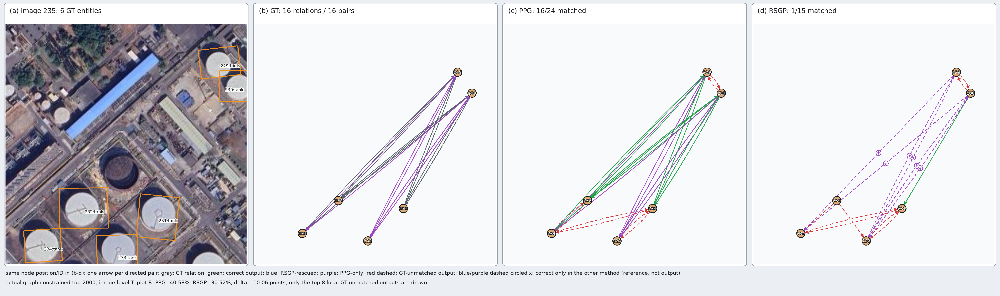

# Paper-ready manuscript package

> Scope: STAR OBB PredCls, SGCls, and SGDet  
> Main method: Dual-view RCA + auxiliary LA + statistical RSGP  
> Metric unit in tables: percentage (%)  
> Status: all reported numerical experiments are complete

This document separates material recommended for the main paper from material
recommended for the appendix. English paragraphs can be copied into a paper
draft directly. Chinese notes beginning with **写作边界** are author reminders
and should be removed before submission.

---

# Part I. Main paper

## Candidate title

**Budget-Constrained Role-Aware Graph Reasoning for Scene Graph Generation in
Large-Scale Satellite Imagery**

Alternative:

**Role-Aware Relation Reasoning and Candidate-Graph Construction for Oriented
Scene Graph Generation**

## Abstract

Scene graph generation in large-scale satellite imagery differs from its
natural-image counterpart in two important aspects: a single image may contain
thousands of oriented entities, producing an excessive number of semantically
valid pairs, and relation instances connected to the same entity may play
different subject and object roles. We present an oriented scene graph
generation framework that addresses both issues. First, role-aware dual-view
relation context aggregation separates shared-subject and shared-object
relation propagation while retaining a common message-update function.
Second, an auxiliary logit-adjustment objective improves class-balanced
predicate learning without modifying inference logits. Third, we formulate
pair proposal as budget-constrained directed candidate-graph construction.
Our Remote-sensing Graph-aware Pair Proposal (RSGP) combines complementary
proposal evidence, oriented geometry, train-derived category-name-agnostic
structural profiles, and degree and semantic-type capacities under the fixed
top-10,000 STAR protocol. On STAR OBB PredCls, the complete method obtains
68.58 R, 45.38 mR, and 54.62 HMR at 2,000 predictions. It also reaches 42.61
and 20.31 HMR on SGCls and SGDet, respectively. Controlled analysis shows that
RSGP is identical to the original proposal graph when truncation is
unnecessary and becomes increasingly effective as candidate overload grows.

## 1. Introduction

Scene graph generation (SGG) transforms detected entities into a structured
representation whose directed edges describe pairwise predicates. Large-scale
satellite imagery makes this problem particularly challenging. Oriented
objects are densely and repeatedly arranged, the number of semantically valid
directed pairs can be orders of magnitude larger than the final prediction
budget, and long-tailed predicates require both local geometry and broader
structural context.

STAR introduced the first large-scale benchmark for satellite-image SGG and a
top-10,000 pair proposal protocol. However, pair filtering and relation
reasoning remain separated: maximizing independent pair recall does not
necessarily construct a graph that is suitable for downstream predicate
classification. In our experiments, PPN attains substantially higher GT-pair
coverage than PPG but lower triplet recall. This observation motivates us to
treat pair proposal as candidate-graph construction rather than independent
binary pair classification.

A second issue arises inside relation reasoning. A unified relation adjacency
connects all edges sharing either endpoint, thereby mixing shared-subject,
shared-object, and cross-role interactions. In remote-sensing layouts, these
interactions need not carry the same semantics. We therefore separate
shared-subject and shared-object propagation into two relation views and use a
shared update operator to avoid increasing the semantic complexity of the
message-passing module.

Based on these observations, our framework combines role-aware dual-view
Relation Context Aggregation (RCA), weak auxiliary logit adjustment (LA), and
Remote-sensing Graph-aware Pair Proposal (RSGP). RSGP uses train-derived soft
structural profiles indexed only by category ID; it never reads category names
or manually specified STAR predicate groups. Under a fixed edge budget, it
selects a directed subgraph using complementary proposal scores and capacity-
regularized greedy selection.

Our contributions are:

1. We introduce role-aware dual-view RCA, which explicitly separates
   shared-subject and shared-object relation propagation while keeping the
   feature update shared.
2. We integrate a weak auxiliary logit-adjustment objective into the
   prototype-based predicate classifier, improving macro recall without
   manually calibrating inference scores.
3. We formulate pair proposal as fixed-budget candidate-graph construction
   and propose statistical RSGP, which combines multi-source evidence with
   degree and semantic-type capacities using category-name-agnostic training
   statistics.
4. We evaluate the resulting framework on STAR OBB PredCls, SGCls, and SGDet,
   and provide candidate-pressure, class-wise, and qualitative analyses.

**写作边界：** STAR、OBB detector、Semantic Filter、PPG、RPCM 的 pair/union
feature、prototype classifier 基础以及 relation-to-relation 传播均不是本文首次
提出。LA 也是已有思想的适配，不能单独声称为全新损失。

## 2. Related work

### 2.1 Scene graph generation

Discuss two-stage SGG, relation context modeling, graph neural networks, and
long-tail predicate learning. Emphasize that existing edge-to-edge propagation
does not explicitly preserve subject/object endpoint roles.

### 2.2 Remote-sensing scene understanding

Discuss oriented detection, large-image patch inference, and STAR. Position
the detector and large-image processing as the experimental foundation rather
than algorithmic contributions.

### 2.3 Relation proposal and graph sparsification

Discuss pair proposal, semantic filtering, graph sparsification, and
budget-aware selection. Contrast independent pair recall with the quality of
the graph consumed by a downstream GNN.

**Citation placeholders:** [STAR], [RPCM], [SGG survey], [long-tail
recognition], [logit adjustment], [graph sparsification].

## 3. Method

### 3.1 Overview

Given oriented entities, training uses Semantic Filter and PPG to construct
the common relation graph. Pair and union representations are processed by
dual-view RCA and a semantic prototype classifier supervised by CE and
auxiliary LA. During inference, RSGP replaces PPG under the same top-10,000
budget; the trained relation head remains unchanged.

~~~text
Training:
OBB entities → Semantic Filter → PPG → pair/union features
→ dual-view RCA → prototype classifier → CE + LA + prototype losses

Inference:
OBB entities → Semantic Filter → statistical RSGP top-10000
→ frozen dual-view RCA/classifier → graph-constrained triplet ranking
~~~

> **Figure 1 to draw — Overall framework.** Use a wide three-part diagram:
> (a) oriented entities and Semantic Filter; (b) PPG/PPN/OBB/statistical
> evidence entering RSGP and producing a fixed-budget candidate graph; (c)
> dual-view RCA, prototype classifier, and auxiliary LA. Use a dashed arrow
> for LA to show that it is training-only.

### 3.2 Problem definition and pair representation

Let

\[
\mathcal V=\{v_i=(b_i,l_i,f_i)\}_{i=1}^{N},
\]

where \(b_i=(x_i,y_i,w_i,h_i,\theta_i)\) is an OBB, \(l_i\) is an object
category, and \(f_i\) is its RoI feature. Semantic Filter constructs

\[
\mathcal E_0=\{(i,j)\mid i\neq j,\;M^{sem}_{l_i,l_j}=1\}.
\]

The relation representation follows the common RPCM pair extractor:

\[
h_{ij}^{r,0}=\Phi_{pair}\!\left(
f_i,f_j,g(l_i),g(l_j),\phi_{pos}(b_i,b_j),f_{ij}^{union}
\right).
\]

This common representation is held fixed across the controlled Base, D, and
DL experiments.

### 3.3 Role-aware dual-view RCA

For \(E=|\mathcal E|\), define subject and object incidence matrices:

\[
(M_s)_{v,e}=\mathbb 1[v=s_e],\qquad
(M_o)_{v,e}=\mathbb 1[v=o_e].
\]

A unified relation graph uses

\[
A_u=\mathbb 1[(M_s+M_o)^\top(M_s+M_o)>0]-I,
\]

which mixes all endpoint-sharing patterns. We instead construct

\[
A_s=\mathbb 1[M_s^\top M_s>0]-I,\qquad
A_o=\mathbb 1[M_o^\top M_o>0]-I.
\]

The normalized residual GCN is

\[
\widetilde A=A+I,\quad
\widehat A=D^{-1/2}\widetilde A D^{-1/2},
\]

\[
\operatorname{GCN}(H,A)=
\sigma\!\left(\widehat A\operatorname{Drop}(H)W+b+
\operatorname{Drop}(H)\right).
\]

Entity-to-relation role collection is

\[
\operatorname{Collect}_{u}(H^e,M_u)=
\frac{M_u^\top\operatorname{ReLU}(H^eW_u+b_u)}
{M_u^\top\mathbf 1+\epsilon},\quad u\in\{s,o\}.
\]

The dual-view relation update is

\[
H_D^{r,l+1}=\frac{1}{4}\left[
\operatorname{Collect}_{s}(H^{e,l},M_s)+
\operatorname{Collect}_{o}(H^{e,l},M_o)+
\operatorname{GCN}_{r}(H^{r,l},A_s)+
\operatorname{GCN}_{r}(H^{r,l},A_o)
\right].
\]

The two relation views share GCN parameters. We average the input and all
updated states,

\[
\bar H^r=\frac{1}{L+1}\sum_{l=0}^{L}H^{r,l},
\]

and obtain the final relation feature through down-sampling, residual MLP, and
LayerNorm. PredCls uses \(L=4\); SGCls and SGDet use \(L=3\).

> **Figure 2 to draw — Unified versus dual-view relation propagation.** Draw
> four directed relations sharing one entity. In the unified branch, place all
> relations in one adjacency. In the proposed branch, separate edges sharing
> the entity as subject from edges sharing it as object. Mark the GCN weights
> as shared between the two views.

### 3.4 Auxiliary logit adjustment

From train-split predicate counts \(n_c\), define

\[
\pi_c=\frac{\max(n_c,1)}{\sum_k\max(n_k,1)}.
\]

The main CE objective remains unchanged. We add

\[
\mathcal L_{LA}=\operatorname{CE}
(\ell+\tau_{LA}\log\pi,y),
\]

and optimize

\[
\mathcal L_{pred}=\mathcal L_{CE}
+\lambda_{LA}\mathcal L_{LA}
+\mathcal L_{pull}+\mathcal L_{sep}+\mathcal L_{ant},
\]

with \(\lambda_{LA}=0.1\) and \(\tau_{LA}=0.5\). Inference always uses the
uncalibrated logits \(\ell\). SGCls and SGDet additionally optimize object
refinement CE.

### 3.5 Statistical RSGP

RSGP selects a fixed-budget directed subgraph:

\[
\max_{\mathcal E\subseteq\mathcal E_0}
\sum_{(i,j)\in\mathcal E}S_{ij},
\]

with priority constraints

\[
|\mathcal E|\le K,\quad d_{out}(i)\le D_o,\quad
d_{in}(j)\le D_i,\quad n_{l_i,l_j}\le Q.
\]

We fix \(K=10{,}000\), following STAR. Degree and semantic-type capacities are
implemented as greedy selection priorities: after strict and relaxed passes,
ranked completion may fill unused budget, so they are soft capacities rather
than guaranteed properties of the final graph.

#### Train-derived structural profiles

Using only train boxes, labels, and relation annotations, we compute for each
category ID \(c\):

\[
\rho_c=\tfrac12\mathbb E[q(A_i)]
+\tfrac12\mathbb E[\operatorname{contain}(i)],
\]

\[
\alpha_c=\mathbb E\left[1-
\frac{\min(w_i,h_i)}{\max(w_i,h_i)}\right],
\]

\[
\kappa_c=\mathbb E\left[
\frac{\log(1+d_i)}{\log(1+N_i)}\right].
\]

They describe contextual-region, directional-alignment, and relational-
connectivity tendencies. The statistical mode indexes these profiles only by
category ID and is invariant to category-name replacement.

#### Multi-source utility

For each candidate pair,

\[
\begin{aligned}
S_{ij}={}&w_p\widehat S^{PPG}_{ij}
+w_n\widehat S^{PPN}_{ij}
+w_g\widehat S^{geom}_{ij}\\
&+w_c\widehat S^{context}_{ij}
+w_a\widehat S^{align}_{ij}
+w_k\widehat S^{connect}_{ij}\\
&+w_rS^{rare}_{ij}
+w_d\widehat S^{balance}_{ij}.
\end{aligned}
\]

The rarity-aware label-pair support is automatically derived from predicate
frequencies:

\[
\omega_r=(f_r+\epsilon)^{-0.5},\qquad
S^{rare}_{ab}=\max_{r:M_{abr}=1}\widetilde\omega_r.
\]

The validation-selected Hybrid configuration protects the top 9,000 PPG edges
and completes the remaining budget using PPN and statistical RSGP evidence.
When \(|\mathcal E_0|\le10{,}000\), RSGP returns the complete semantic graph
and is identical to PPG.

**写作边界：** semantic-type capacity 是最稳定的 RSGP 组件。统计结构角色的
独立影响较小且存在 val/test 方向反转，因此正文中称其为 auxiliary structural
evidence，不声称其在每个 split 上独立提升。

## 4. Experiments

### 4.1 Dataset, tasks, and metrics

We use the fixed STAR split with 771/245/264 train/validation/test images, 48
foreground object categories, and 58 foreground predicates. All experiments
use OBBs and the fixed top-10,000 pair budget.

| Task | Boxes | Object outputs | Predicate outputs |
|---|---|---|---|
| PredCls | GT | GT | predicted |
| SGCls | GT | predicted | predicted |
| SGDet | predicted | predicted | predicted |

To compare directly with STAR/SGG-ToolKit, SGCls uses GT labels only during
pair filtering and SGDet uses labels assigned by matched GT only during pair
filtering. Final object and predicate outputs remain model predictions. A
strict predicted-filter-label protocol is reported in the appendix.

For predicate \(c\), let \(R_c@K\) denote its recall. We report

\[
mR@K=\frac1{58}\sum_{c=1}^{58}R_c@K,
\]

and

\[
HMR@K=\frac{2(R@K)(mR@K)}{R@K+mR@K}.
\]

Main tables use \(K\in\{1500,2000\}\).

### 4.2 Implementation details

All controlled PredCls rows load the same frozen Swin-L OBB detector and use
the same pair extractor, prototype classifier, optimizer budget, and PPG
validation filter. Base, D, and DL differ only in relation adjacency and LA.
PredCls and SGCls report the checkpoint with the best validation HMR; SGDet
reports the fixed 5,000-step endpoint. RSGP is inference-only and Full reuses
the byte-identical DL checkpoint.

The public test configuration is statistical RSGP Hybrid 9000/1000 with
degree capacity 96/96, semantic-type capacity 800, relaxed capacity 128/128
and 1,200, PPN pool 12,000, and statistical structural pool 12,000.

### 4.3 Validation-only RSGP selection

We select the RSGP mode and PPG protected-pool size on validation after fixing
the DL checkpoint. Eligible candidates must improve HMR over PPG while
reducing R by no more than 0.2 percentage points. Hybrid 9000/1000 obtains the
highest eligible validation HMR and is frozen before final reporting.

| Validation filter | R@2000 | mR@2000 | HMR@2000 | GT-pair coverage |
|---|---:|---:|---:|---:|
| PPG | 60.85 | 39.80 | 48.12 | 72.88 |
| PPN | 60.14 | 38.67 | 47.07 | **86.28** |
| RSGP RS-only | 62.77 | 41.53 | 49.99 | 74.43 |
| RSGP PPN-graph | **63.31** | 42.02 | 50.52 | 76.53 |
| Hybrid 7000/3000 | 63.03 | 42.26 | 50.60 | 70.66 |
| Hybrid 8000/2000 | 63.01 | 42.24 | 50.58 | 70.66 |
| **Hybrid 9000/1000** | 63.02 | **42.31** | **50.63** | 70.66 |

## 5. Results

### 5.1 Controlled PredCls ablation

| Row | R@1500 | R@2000 | mR@1500 | mR@2000 | HMR@1500 | HMR@2000 |
|---|---:|---:|---:|---:|---:|---:|
| Base (Unified) | **68.63** | **70.39** | 39.77 | 40.98 | 50.36 | 51.80 |
| D: Dual-view RCA | 68.12 | 69.68 | 41.02 | 42.18 | 51.21 | 52.55 |
| DL: Dual-view + LA | 65.46 | 67.11 | 41.99 | 43.42 | 51.16 | 52.72 |
| **Full: DL + RSGP** | 67.23 | 68.58 | **43.82** | **45.38** | **53.06** | **54.62** |

Dual-view RCA improves mR/HMR while slightly reducing overall R. Auxiliary LA
further raises mR but trades 2.58 points of R for a smaller 0.17-point HMR
gain. Replacing PPG with RSGP on the exact same DL checkpoint then improves
R/mR/HMR@2000 by 1.47/1.96/1.90 points. Thus, the complete method has the
highest class-balanced and harmonic recall, although Base retains the highest
overall R.

### 5.2 Comparison with STAR/RPCM

| Task/method | R@1500 | R@2000 | mR@1500 | mR@2000 | HMR@1500 | HMR@2000 |
|---|---:|---:|---:|---:|---:|---:|
| STAR PredCls RPCM | 64.25 | 65.88 | 41.22 | 42.28 | 50.22 | 51.51 |
| **Ours PredCls Full** | **67.23** | **68.58** | **43.82** | **45.38** | **53.06** | **54.62** |
| STAR SGCls RPCM | 51.29 | 52.72 | 30.04 | 30.85 | 37.89 | 38.92 |
| **Ours SGCls Full** | **56.75** | **57.78** | **32.90** | **33.75** | **41.65** | **42.61** |
| STAR SGDet RPCM | 27.23 | 28.50 | 11.53 | 12.07 | 16.20 | 16.96 |
| **Ours SGDet Full** | **32.98** | **33.65** | **14.11** | **14.55** | **19.76** | **20.31** |

The complete method improves HMR@2000 over the reported RPCM result by 3.11,
3.69, and 3.35 points on PredCls, SGCls, and SGDet, respectively.

### 5.3 Candidate graph quality

| Filter | GT-pair coverage | Node coverage | Degree Gini | Max degree | Label-pair entropy | R@2000 | mR@2000 | HMR@2000 |
|---|---:|---:|---:|---:|---:|---:|---:|---:|
| PPG | **79.89** | 99.28 | **0.1637** | **252** | 1.8587 | 67.11 | 43.42 | 52.72 |
| **RSGP** | 75.33 | **99.42** | 0.1694 | 740 | **2.0263** | **68.58** | **45.38** | **54.62** |

RSGP produces higher downstream recall despite lower GT-pair coverage. It also
increases semantic label-pair entropy. This supports the central claim that
pair recall is not a sufficient measure of candidate-graph quality. Because
unconstrained completion is used when capacity-constrained passes do not fill
the budget, the final degree Gini and maximum degree are not always lower than
PPG; we therefore describe degree constraints as selection capacities rather
than guaranteed final-graph bounds.

### 5.4 Candidate-pressure analysis

| Candidate pressure | Images | PPG HMR@2000 | RSGP HMR@2000 | Gain |
|---|---:|---:|---:|---:|
| No truncation (≤10k) | 160 | 61.15 | 61.15 | 0.00 |
| Low overload (10k–20k) | 28 | 45.70 | **47.54** | +1.84 |
| Medium overload (20k–50k) | 32 | 36.39 | **39.30** | +2.91 |
| High overload (>50k) | 44 | 27.07 | **31.21** | +4.14 |

PPG and RSGP are exactly identical when proposal truncation is unnecessary.
Under a fixed top-10,000 budget, the HMR advantage grows from 1.84 points in
low-overload scenes to 4.14 points in high-overload scenes. This isolates the
benefit of candidate-graph selection from unrelated relation-head changes.

### 5.5 Qualitative analysis

All three examples contain more than 10,000 semantic-valid pairs, and both PPG
and RSGP therefore execute their respective filters before the same relation
head produces the final graph-constrained top-2,000 predictions. To avoid
burying small remote-sensing objects under edges, each figure contains one
satellite crop followed by three spatially aligned scene graphs: GT, PPG, and
RSGP. Every GT entity in the crop appears in all three graphs at exactly the
same location and with the same node ID. A deterministic collision-resolution
step preserves the projected spatial layout while enforcing a minimum node
distance. For image 440 only, a visualization-only refinement moves the lower
of the two central hubs slightly downward, spreads the upper fan horizontally,
and shifts the left fan outward; the already readable right fan remains anchored
apart from sub-pixel collision correction. The identical adjusted coordinates
are used in GT, PPG, and RSGP, and neither predictions nor metrics are changed.
Three-digit node IDs in this dense case use an adaptive font while sparse cases
retain their original typography. Predicate text is omitted and multiple predicates on one directed entity
pair are collapsed into one structural arrow; reverse pairs use separate shallow
curves. Exact triplet counts remain in the panel titles and manifest. Gray denotes GT edges;
green denotes matched model outputs, blue denotes matched outputs recovered
only by RSGP, and purple denotes PPG-only correct outputs. A blue or purple
dashed edge with a circled x is a comparison reference: the relation is correct
only in the other method and is absent from the current panel; it is not a model
output. Red dashed edges are actual outputs unmatched by the available GT; at
most eight are shown per panel because STAR annotations are not exhaustive and
the purpose is structural comparison rather than false-positive counting. All
GT entities and directed GT pairs are drawn using the same edge weight as the
prediction panels; exact full relation counts and pairs are also retained in the
artifact manifest. Curved routes are assigned from the edges actually displayed
in each panel, so hidden reverse predictions cannot bend an otherwise isolated
visible relation.

#### Airport-hub success: image 440



**Figure caption.** In an overloaded airport crop, the aligned graphs contain
68 GT entities and 105 GT relations. PPG produces 40 matched triplets among 562
local top-2,000 outputs, whereas RSGP produces 80 among only 305. Blue edges are
exact final triplets recovered only by RSGP; image-level triplet recall increases
from 54.71% to 84.98%.

**Analysis.** The crop contains a terminal/apron-centered layout surrounded by
airplanes, boarding bridges, and taxiways. RSGP doubles the number of locally
matched outputs (40 to 80) while reducing the local output count by about 46%
(562 to 305). The denser green and blue structure around the central carriers,
together with fewer unmatched outputs, demonstrates selective budget allocation
rather than indiscriminate proposal expansion. The +30.27-point image-level gain
also makes the improvement visually and numerically clearer than a marginal
single-hub example.

#### Readable high-overload success: image 748



**Figure caption.** This crop contains 26 GT entities and 22 GT relations while
the full image contains 45,332 semantic-valid candidate pairs. Under the same
10,000-pair budget and relation checkpoint, the local matched-output count
increases from 4/174 for PPG to 18/108 for RSGP, and image-level triplet recall
increases from 17.08% to 50.83%. The clean graph view exposes the recovered
relations without relying on tiny, overlapping ship symbols.

**Analysis.** Complementing the airport-hub layout in image 440, this crop
contains several spatially separated local components. PPG emits 174 local triplets but
matches only four, whereas RSGP emits fewer local triplets (108) and matches 18.
The 4.5-fold increase in matched outputs and the 33.75-point image-level recall
gain provide the clearest qualitative evidence that candidate quantity alone
does not determine downstream graph quality. RSGP retains more edges aligned
with the GT components while suppressing several long-range, cross-component
outputs. Because only the eight highest-scoring GT-unmatched outputs are drawn,
the red-edge count is illustrative and must not be read as an exact precision
measure.

#### Explicit failure case: image 235



**Figure caption.** This failure crop contains six GT entities and 16 GT
relations. PPG produces 16 matched triplets among 24 local outputs, whereas
RSGP retains only one among 15; image-level triplet recall decreases from
40.58% to 30.52%. Purple solid edges are correct PPG-only outputs; their dashed
circled-x counterparts in the RSGP panel expose the corresponding lost triplets
without placing predicate labels over the graph.

**Analysis.** The crop is a compact, semantically homogeneous tank group with a
dense 16-pair GT subgraph. PPG preserves all 16 locally matched triplets, while
RSGP retains only one; the purple PPG-only edges and circled-x references make
this failure explicit. This behavior is consistent with the graph-capacity
mechanism reallocating budget away from a highly repetitive local pattern in
the globally overloaded image. It reveals an important limitation: diversity-
and degree-aware selection can suppress legitimate dense homogeneous
relations. Accordingly, this case is reported alongside the successes rather
than hidden, and motivates adaptive capacity control in future work.

## 6. Limitations

The independent effects of PPN completion, generic geometry, and statistical
structural profiles are small and sometimes reverse between validation and
test. The strongest stable RSGP component is semantic-type capacity, followed
by smaller contributions from rarity support and degree-aware selection. The
current greedy solver also uses unconstrained completion to preserve the STAR
top-10,000 protocol, so its final graph does not strictly satisfy all capacity
bounds. Finally, the strict predicted-filter-label protocol remains below the
STAR-compatible protocol, especially for SGDet, where missed detections impose
an upper bound on relation recall.

## 7. Conclusion

We presented an OBB scene graph generation framework for large-scale satellite
imagery. Role-aware dual-view RCA separates subject- and object-conditioned
relation interactions, auxiliary LA improves class-balanced predicate
learning, and statistical RSGP constructs a downstream-oriented candidate
graph under a fixed budget. Experiments across PredCls, SGCls, and SGDet show
consistent HMR improvements over STAR/RPCM, while pressure analysis confirms
that RSGP specifically addresses scenes requiring aggressive pair truncation.

---

# Part II. Appendix / supplementary material

## A. Complete validation component audit

This is a **post-freeze consistency audit**, not an additional hyperparameter
selection pass. Hybrid 9000/1000 and the DL checkpoint were already fixed. It
must not be described as test-driven model selection.

| Validation variant | R@2000 | mR@2000 | HMR@2000 | GT-pair coverage |
|---|---:|---:|---:|---:|
| Full | 63.02 | 42.31 | 50.63 | 70.66 |
| w/o PPN completion | 63.05 | **42.37** | **50.68** | 70.19 |
| w/o geometry | **63.07** | 42.29 | 50.63 | 70.63 |
| w/o structural roles | 62.82 | 42.11 | 50.42 | 72.35 |
| w/o degree control | 63.06 | 42.24 | 50.59 | 70.34 |
| w/o semantic capacity | 61.61 | 40.85 | 49.13 | **74.13** |
| w/o rarity support | 62.80 | 42.14 | 50.44 | 69.03 |

The complete audit shows that semantic capacity is the dominant component.
Rarity support and structural roles provide small validation gains, degree
control is nearly neutral, and PPN completion/geometry are not independently
positive on validation.

## B. Frozen-protocol test component ablation

| Test variant | R@2000 | mR@2000 | HMR@2000 |
|---|---:|---:|---:|
| Full | 68.58 | **45.38** | 54.62 |
| w/o PPN completion | 68.35 | 45.24 | 54.45 |
| w/o geometry | 68.66 | 45.24 | 54.54 |
| w/o structural roles | **68.80** | 45.36 | **54.68** |
| w/o degree control | 68.37 | 45.11 | 54.36 |
| w/o semantic capacity | 67.85 | 44.33 | 53.62 |
| w/o rarity support | 68.31 | 45.25 | 54.43 |

## C. Cross-split evidence boundary

Positive values mean Full is better than the corresponding reference.

| Comparison | Validation ΔHMR | Test ΔHMR | Permitted claim |
|---|---:|---:|---|
| Full RSGP − PPG | **+2.51** | **+1.90** | Stable overall RSGP gain |
| Full − w/o PPN | -0.05 | +0.17 | Complementary source; no stable independent gain |
| Full − w/o geometry | ≈0.00 | +0.08 | Near-neutral validation, small test gain |
| Full − w/o structural roles | +0.21 | -0.06 | Small and split-dependent auxiliary evidence |
| Full − w/o degree control | +0.04 | +0.26 | Same direction, small validation effect |
| Full − w/o semantic capacity | **+1.50** | **+0.99** | Strongest stable component |
| Full − w/o rarity support | +0.19 | +0.18 | Small consistent gain |

Do not delete the w/o structural roles reversal and do not claim that every
component independently improves every split. The defensible headline is the
stable overall RSGP improvement; structural profiles remain an auxiliary term.

## D. Strict predicted-filter-label results

| Task/filter | R@1500 | R@2000 | mR@1500 | mR@2000 | HMR@1500 | HMR@2000 |
|---|---:|---:|---:|---:|---:|---:|
| SGCls PPG | 45.79 | 46.78 | 25.50 | 26.09 | 32.76 | 33.50 |
| **SGCls RSGP** | **46.69** | **47.40** | **26.06** | **26.56** | **33.45** | **34.05** |
| SGDet PPG | 29.21 | 30.26 | 11.62 | 12.39 | 16.63 | 17.58 |
| **SGDet RSGP** | **29.84** | **30.90** | **12.10** | **12.85** | **17.22** | **18.15** |

## E. Per-predicate results

The complete 58-predicate Base/D/DL/Full table is maintained in
[per_predicate_supplement.md](per_predicate_supplement.md). Representative
fixed-checkpoint PPG→RSGP changes are:

| Predicate | Count | PPG R@2000 | RSGP R@2000 | Change |
|---|---:|---:|---:|---:|
| around | 152 | 33.77 | 55.06 | +21.29 |
| parallelly docked at | 2,891 | 64.39 | 76.92 | +12.53 |
| approach | 930 | 40.01 | 51.54 | +11.53 |
| run along | 219 | 73.61 | 83.86 | +10.25 |
| parking in the different apron with | 18,104 | 45.57 | 39.26 | -6.31 |
| running along the different taxiway with | 466 | 29.23 | 24.05 | -5.18 |

## F. Reproducibility and result provenance

| Result | JSON source |
|---|---|
| Base | outputs/paper_submission/predcls/unified/test/ppg/test_metrics.json |
| D | outputs/paper_submission/predcls/dual/test/ppg/test_metrics.json |
| DL | outputs/paper_submission/predcls/dual_la/test/ppg/test_metrics.json |
| Full | outputs/paper_submission/predcls/dual_la/rsgp_component_test/rsgp_full/test_metrics.json |
| SGCls Full | outputs/paper_submission/sgcls/test/legacy/rsgp_statistical/test_metrics.json |
| SGDet Full | outputs/paper_submission/sgdet_rpcm_budget/test/legacy/rsgp_statistical/test_metrics.json |

Public evaluation:

~~~bash
bash scripts/test_star_predcls_full.sh
bash scripts/test_star_sgcls_full.sh
bash scripts/test_star_sgdet_full.sh
~~~

Public training:

~~~bash
bash scripts/train_star_predcls_full.sh
bash scripts/train_star_sgcls_full.sh
bash scripts/train_star_sgdet_full.sh
~~~

The public checkpoint checksums and metric provenance are recorded in
pretrained/full/manifest.json.

## G. Suggested main/appendix placement

| Material | Main paper | Appendix |
|---|:---:|:---:|
| Overview and dual-view diagrams | ✓ |  |
| Controlled Base/D/DL/Full table | ✓ |  |
| Three-task STAR/RPCM comparison | ✓ |  |
| Candidate graph and pressure analysis | ✓ | extended values optional |
| Two filtered success cases | ✓ |  |
| Failure case | short discussion | ✓ full panel |
| RSGP validation grid | compact table | ✓ machine provenance |
| Complete val component audit |  | ✓ |
| Complete test component ablation | compact or appendix | ✓ |
| Cross-split component boundary | one sentence | ✓ |
| Strict predicted-label protocol |  | ✓ |
| Complete 58-predicate table |  | ✓ |
| Environment/checkpoint provenance |  | ✓ |

## H. Claims checklist

Safe claims:

- Full RSGP improves HMR over PPG on both validation and test.
- RSGP becomes more useful as candidate overload increases.
- Higher GT-pair coverage alone does not guarantee higher triplet recall.
- Dual-view RCA and LA improve class-balanced recall in the controlled chain.
- Semantic-type capacity is the strongest stable RSGP component.

Claims to avoid:

- Every module independently improves every split.
- Structural profiles provide a stable standalone test gain.
- RSGP always lowers degree Gini or maximum degree.
- Full has higher overall R than Base.
- Detector/cache compatibility fixes are algorithmic contributions.

## I. Environment and public reproduction

The public Full train/test route was verified in the following clean stack:

```text
Python 3.11
PyTorch 2.2.2 + CUDA 12.1
torchvision 0.17.2
mmcv-full 1.7.2 with compiled CUDA operators
```

Its complete runtime dependency closure contains eight direct packages
(`torch`, `torchvision`, `numpy`, `opencv-python`, `Pillow`, `h5py`, `tqdm`,
and `mmcv-full`) plus the four MMCV helpers `addict`, `packaging`, `PyYAML`,
and `yapf`. The public Full route does not require PyG, mmrotate, mmdet,
maskrcnn_benchmark, scikit-learn, or scipy.

```bash
# Install and verify the isolated environment
bash scripts/create_clean_env.sh
conda activate sgg
python tools/check_environment.py --strict --require-cuda
bash scripts/smoke_test_clean_env.sh

# Train Full from detector-only initialization
bash scripts/train_star_predcls_full.sh
bash scripts/train_star_sgcls_full.sh
bash scripts/train_star_sgdet_full.sh

# Evaluate the released Full checkpoints
bash scripts/test_star_predcls_full.sh
bash scripts/test_star_sgcls_full.sh
bash scripts/test_star_sgdet_full.sh
```

SGDet additionally requires the version-matched frozen detection cache built
with `bash scripts/build_sgdet_detection_cache.sh`. Detailed installation and
artifact instructions are provided in `INSTALL.md` and `README.md`.
